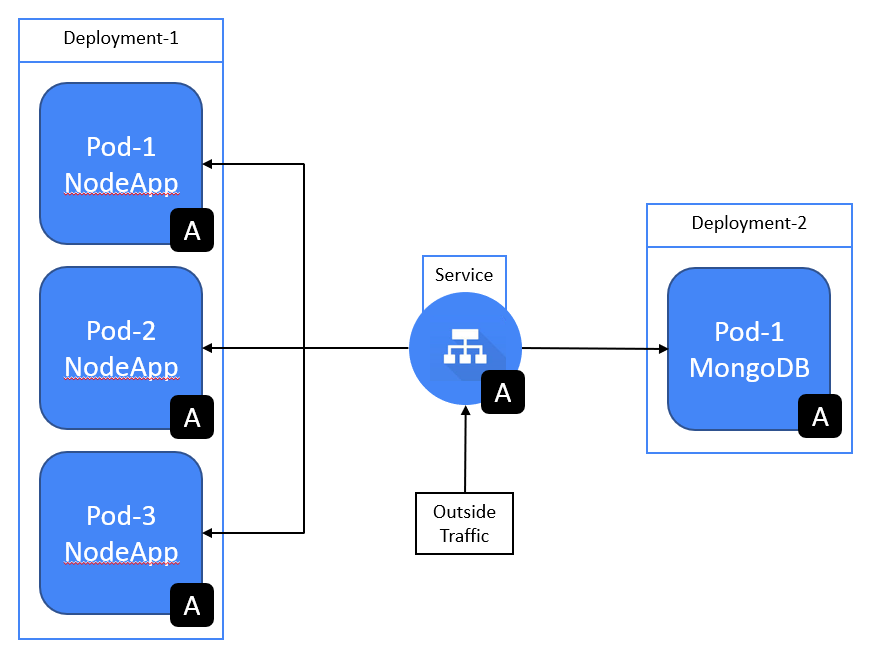

# Kubernetes
## What is Kubernetes?
When using Docker, we can create containers. These are essentially VM's, but with less restricted deployment properties. Docker is able to more effectively share the resources of the Localhost machine between all of the containers that are in use. Therfore, Docker containers are preferred over standard VM's.

Kubernetes is container orchestration software that manages the the deployment of Docker containers. It is able to restart or replace containers that fail, shut down containers that don't pass the user-defined health checks and it can store and manage sensitive information so you don't have to (e.g. SSH keys, OAuth tokens).

### Advantages
- Better resource allocation and scheduling
- Automated management of container instances
- Allows for Infrastructure as Code
- Increased scalability
- Easier configuration management
- Plenty of documentation and community support

### Disadvantages
- Not very user-friendly
- Steep learning curve
- Logs are hard to read/interpret

Overall, Kubernetes ensures that we have a system with high availability and scalability, as well as good disaster recovery.

##
A pod is an abstraction over the container. Kubernetes essentially creates a running environment for the container. This makes the pods more easily replacable and takes the user a step further away from Docker, meaning that they don't need to use it as much.

Pods can containe more than 1 container, but it is best practice to leave it at 1 container per pod.

Kubernetes runs a virual network, so each pod gets it's own unique IP address, however, when a pod is disables (because the application within its container crashed or ran out of resources), a new unique IP address is assigned to the new pod. This can be inconvenient so *"Service"* is used within Kubernetes.

*Service* is essentially a permanent IP address that can be attatched to pods. If a pod is disabled, the new pos will keep the old *Service*. 

Use "Labels" to tell the Service what deployment to connect to.

## Commands
`kubectl` - Stand for "Kube control", if want any information, use this
`kubectl get service` - Information about the Kubernetes clusters [DO NOT DELETE THE MAIN "kubernetes" SERVICE]
`kubectl create -f name.yml`
`kubectl get deploy`
`kubectle get pods` - Gives pod names
`kubectl describe pod <podname>` - Gives information about the pod
`kubectl describe deploy <deploymentname>` - Gives information on the deployment
`kubectl edit deploy <deploymentname>` - This opens an editor to edit the deplyment specs (need to save and exit when done)
`kubectl create -f <name.yml>` - Executes the YAML file
`kubectl get service` - Prints available services
`kubectl delete <servicetype> <itemname>` (servicetype = deploy, pod etc)
`kubectl create namespace <name>` - Creates a namespace with the given name
`kubectl delete namespace <name>`

